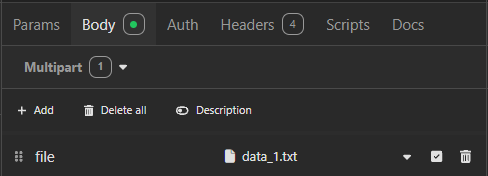
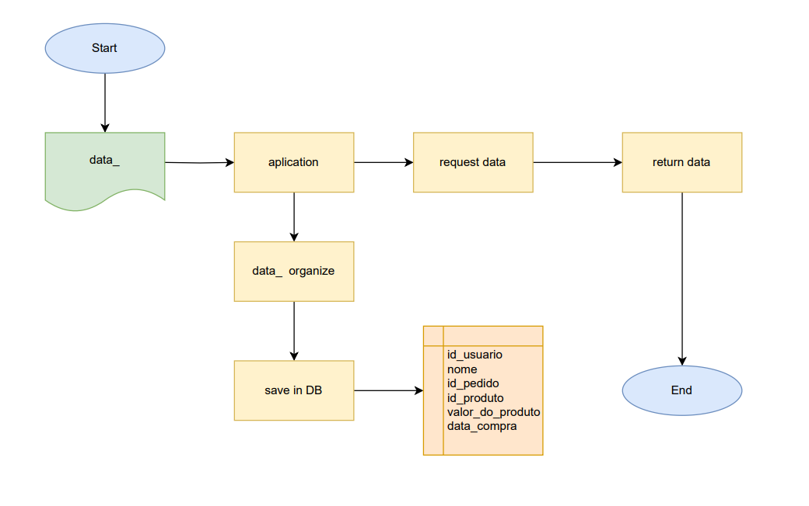

# Order Data Organizer

## Sobre o projeto

**Order Data Organizer** é um projeto que tem como objetivo processar arquivos TXT contendo dados de pedidos desnormalizados. Esses arquivos possuem informações do usuário, do pedido e dos produtos. O sistema organiza os dados, normaliza as informações e os persiste em um banco de dados Oracle.  

Com isso, é possível realizar consultas específicas, como:  
- Listar todos os dados de pedidos.  
- Buscar pedidos por ID.  
- Filtrar pedidos por intervalo de datas.  

---

## Requisitos

- **Java 21**  
- **Docker**

---

## Build e Deploy

1. Crie a imagem do banco Oracle utilizando o `docker-compose` presente na raiz do projeto:  
   ```bash
   docker-compose up -d --build
   ```
2. Build da aplicação com Maven:  
   ```bash
   mvn clean install
   ``
2. Rode a aplicação com a JVM do Java:  
   ```bash
   java -jar target/order-data-organization.jar
   ```

---

## Funcionalidades

### 1. **Carregar arquivos**
Endpoint para carregar um arquivo TXT e processar os dados:
- **POST**: `http://localhost:8081/orders/upload`  
  - Enviar o arquivo no formato **Form Data**.  



---

### 2. **Paginação de pedidos**
Endpoint para listar pedidos com paginação:
- **GET**: `http://localhost:8081/orders?page=0&size=10&sort=desc`

---

### 3. **Buscar pedido por ID**
Endpoint para buscar detalhes de um pedido específico pelo ID:
- **GET**: `http://localhost:8081/orders/{id}`

---

### 4. **Buscar pedidos por intervalo de datas**
Endpoint para listar pedidos dentro de um intervalo de datas:
- **GET**: `http://localhost:8081/orders/date-range?startDate=yyyy-mm-dd&endDate=yyyy-mm-dd`

---

## Estrutura do Projeto

Este repositório contém exclusivamente a **API Backend**. Não há integração com frontend ou interfaces visuais.

---

## Tecnologias

As seguintes tecnologias foram utilizadas no desenvolvimento deste projeto:

- **[Java 21](https://www.oracle.com/java)**  
- **[Oracle Database](https://docs.oracle.com/en/database/oracle/oracle-database/index.html)**  
- **[Docker](https://docs.docker.com/)**  

---

## Arquitetura

Este projeto utiliza o padrão de projeto MVC, estruturado da seguinte forma:

- Model: Responsável pela representação dos dados e das entidades do sistema, incluindo pedido e suas informações.
- View: Exposta através de APIs REST (implementada pelo Spring Boot), que interage com os usuários ou sistemas externos.
- Controller: Lida com as requisições recebidas, processa os dados, realiza validações e delega responsabilidades ao serviço e ao repositório.

## Fluxograma



---
